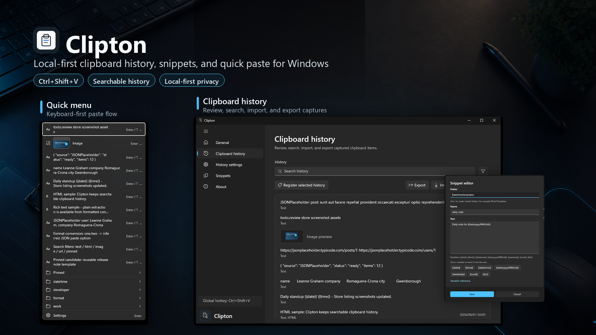

# Clipton

Clipton is a local-first clipboard manager for Windows. It keeps recent clipboard history, registered text snippets, and quick paste commands close to the keyboard while avoiding cloud sync, telemetry, and network dependencies.



## Features

- WinUI resident app with a system tray icon.
- Global hotkey menu, default `Shift+Alt+V`, with preset fallback shortcuts when the default is unavailable.
- Clipboard history capture for text, RTF, HTML, images, and file drops.
- Keyboard-driven quick menu with folder navigation, search, plain-text paste, temporary mask reveal, and timestamp display.
- Default and rich quick menu styles, including thumbnail and image preview support.
- Paste history items in their original clipboard format when possible.
- Registered snippets with folder support.
- Register snippets directly from history.
- Configurable hotkey, startup registration, light/dark/system theme, language, and saved history limit.
- Pause capture, clear history, sensitive-content masking, PIN lock, and encrypted local history.
- Local-only privacy posture: no cloud sync, telemetry, crash reporting, ads, or third-party data sharing.
- UI strings for English, Japanese, German, Spanish, French, Korean, and Simplified Chinese.
- Unit tests for history, hotkeys, settings, localization completeness, clipboard bridge behavior, encrypted persistence, and quick menu theme palettes.

## Run

```powershell
dotnet run --project src\Clipton.WinUI\Clipton.WinUI.csproj
```

The app starts in the tray. Double-click the tray icon to open the settings/history window.

## Test

```powershell
dotnet test Clipton.slnx
```

Coverage measurement is documented in [docs/COVERAGE.md](docs/COVERAGE.md).

## Local data

Settings, snippets, encrypted history, and thumbnails are stored under `%APPDATA%\Clipton` by default. The app can also be launched with `--data-dir <path>` for isolated validation runs.

- `settings.json`: hotkey, startup, language, and history size settings.
- `snippets.dat`: encrypted registered text snippets. Legacy `snippets.json` is migrated when found.
- `history\manifest.dat`: encrypted-history ordering and format metadata.
- `history\items\*.dat`: encrypted clipboard history payloads, one item per file.
- `thumbs\`: local image thumbnails used by the quick menu.
- `%LOCALAPPDATA%\Clipton\TempPaste`: temporary files used for paste and image preview operations.

Clipboard history is encrypted and persisted locally by default. Users can disable encrypted local history in the settings window. When enabled, history payloads are protected with Windows user-scoped DPAPI. Older single-file, segmented, and chunked history stores remain readable and are upgraded to the current itemized format.

See [docs/PERSISTENCE_PERFORMANCE.md](docs/PERSISTENCE_PERFORMANCE.md) for the persistence performance comparison.

## Privacy

Clipton reads clipboard content only to show recent clipboard history and paste selected items. The current version does not upload clipboard content, settings, snippets, or usage data to any server.

- Privacy policy: <https://mmiyaji.github.io/clipton/privacy/>
- Terms of use: <https://mmiyaji.github.io/clipton/terms/>

## Store readiness

The current release candidate is `0.1.20`. The WinUI packaging project produces the Store upload bundle, and `tools\ci\verify-store-package.ps1` verifies package structure plus all seven shipped UI languages. Microsoft Store submission still requires final Partner Center metadata, clean-profile installation, and WACK validation.

- Store preparation checklist: [docs/STORE_PREP.md](docs/STORE_PREP.md)
- Store listing draft: [docs/STORE_LISTING.md](docs/STORE_LISTING.md)
- Store screenshot assets: [artifacts/store](artifacts/store)
